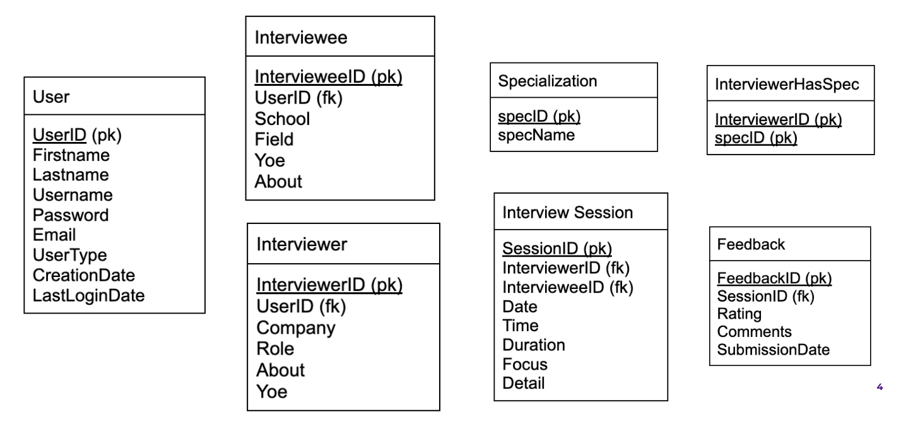
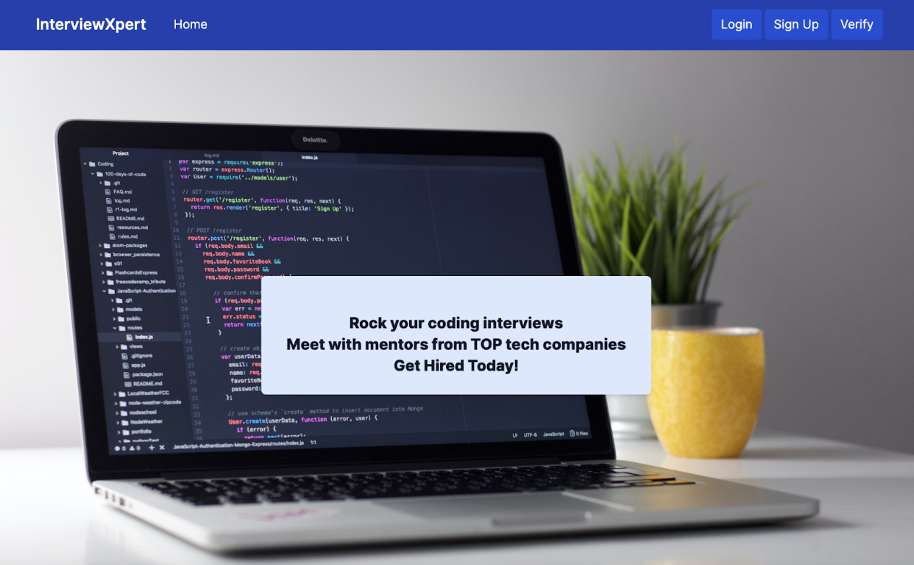
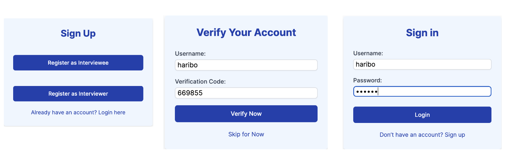
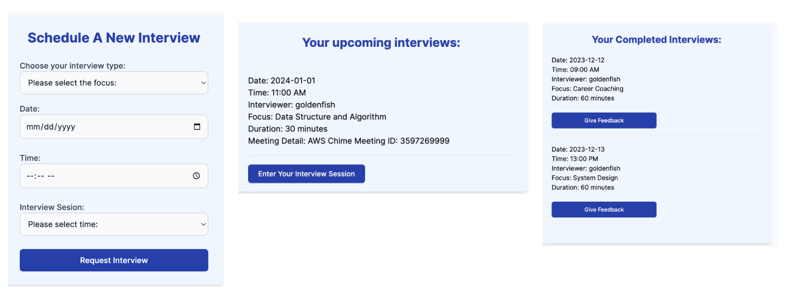
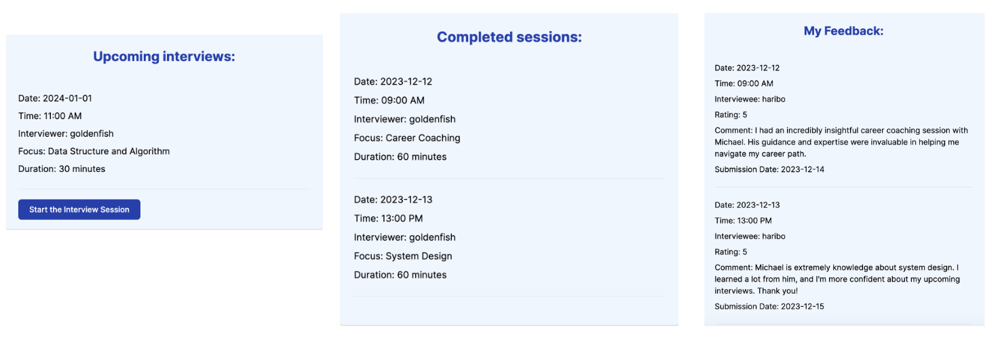
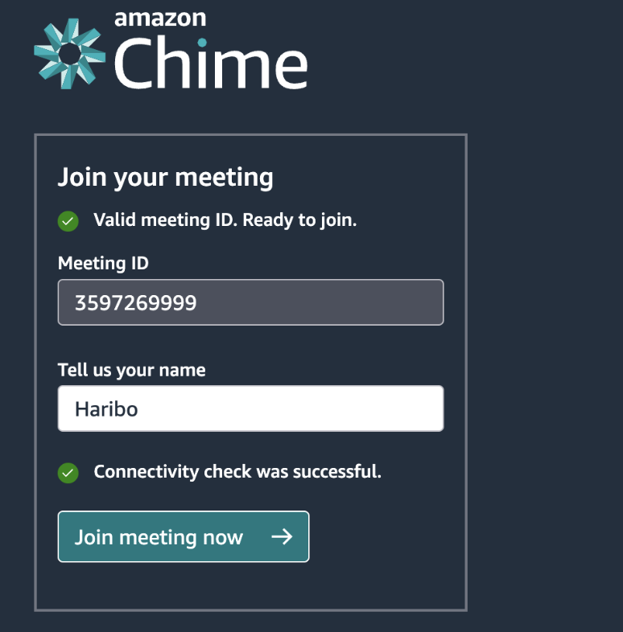

# InterviewXpert 

## Introduction: 
InterviewXpert is a personalized interview preparation platform that leverages **AWS cloud services** to help users improve their interviewing skills. 
InterviewXpert offers the following key features: 
- Schedule mock interviews
- Match interviewers with interviewees based on their skills
- View upcoming and completed interview sessions
- Conduct interview sessions on AWS Chime
- Collect feedback including ratings and comments from interviewees

## AWS Services Used: 
- Frontend: AWS Amplify
- Compute: Lambda
- Database: AWS RDS, OpenSearch
- Networking: API Gateway
- Authentication: Cognito
- Messaging: SQS, SES
- Video Streaming: AWS Chime

## AWS Architecture: 

## Database Design:

## Video Demo:

## Work Flow:
### Homepage:

### Authentication:

### Interviewee Interface:

### Interviewer Interface:

### AWS Chime:

